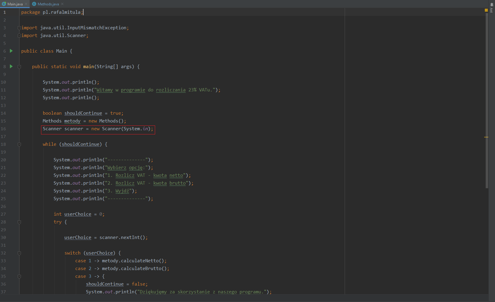
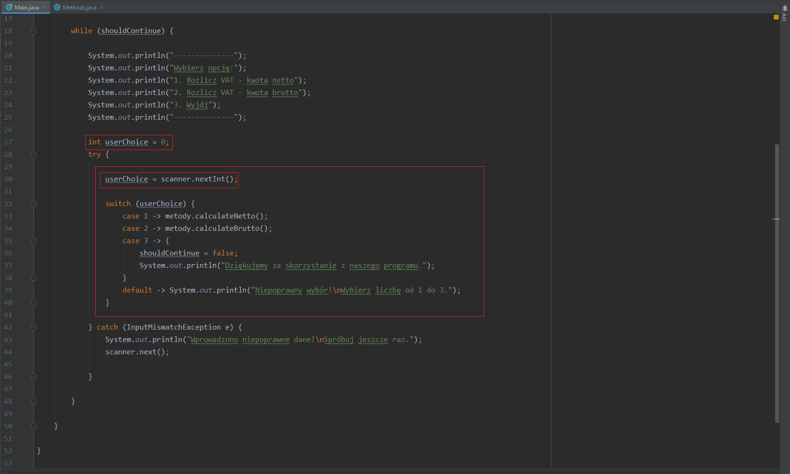
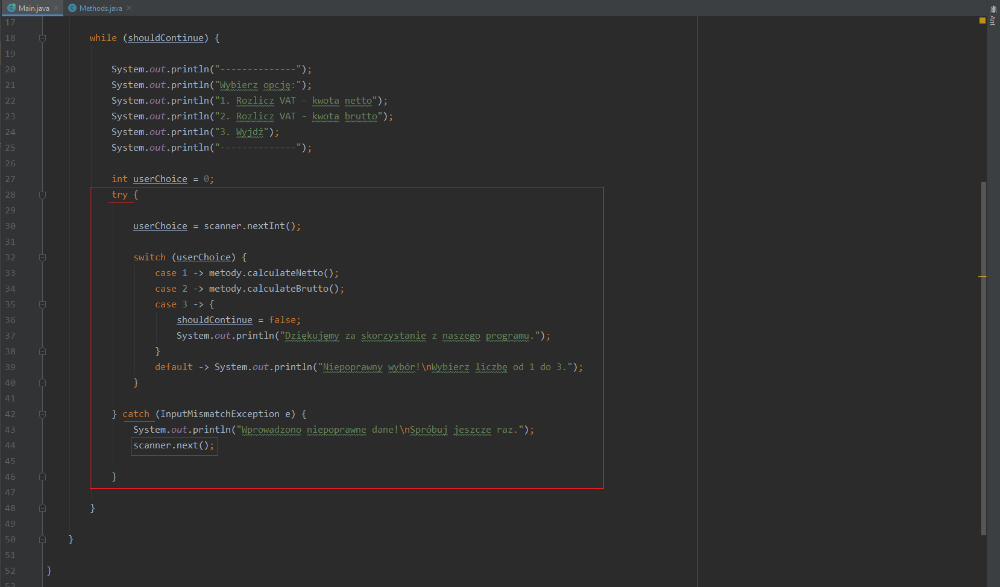
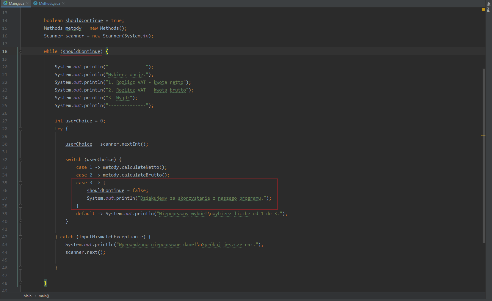
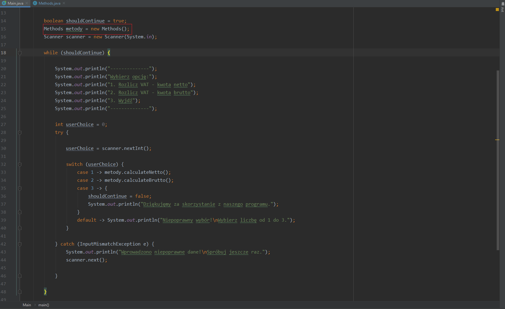
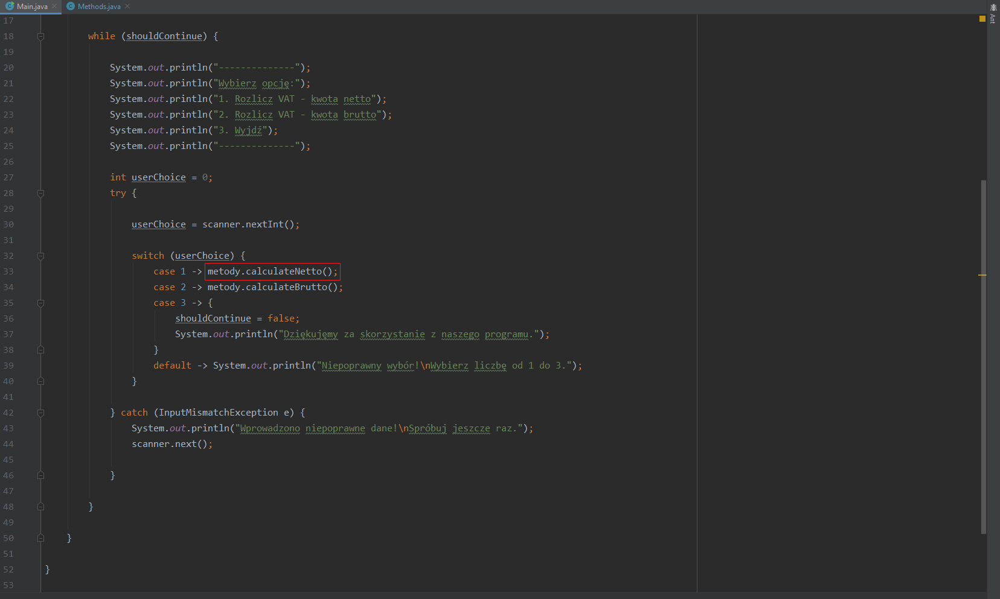
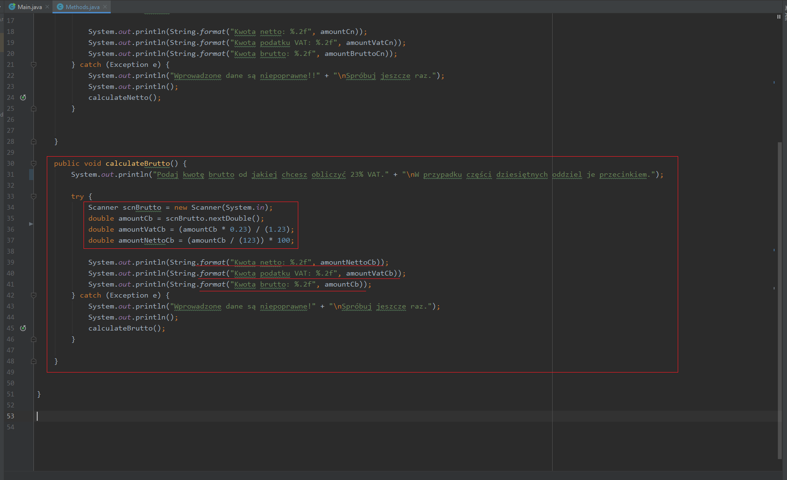
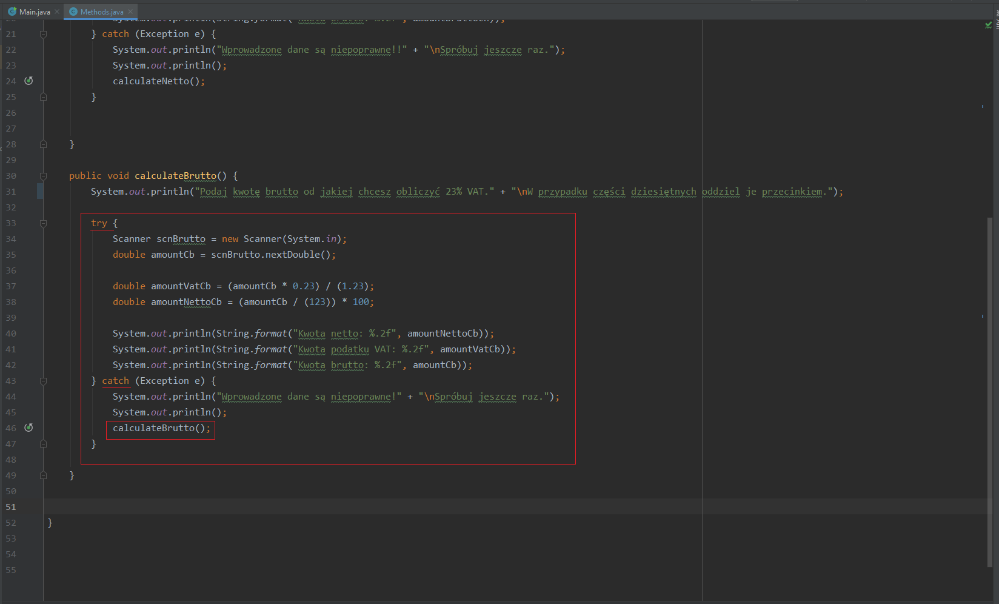

# tax calculation program 

## Table of contents
* [General info](#general-info)
* [Technologies](#technologies)
* [Description](#description)
* [Inspiration](#inspiration)

## General info

This is a console application which calculates the amount of 23% tax. User can choose between two options: the gross price and the net price. Moreover this applications shows separently the net amount, the gross amount and the tax amount.

## Technologies 
* Java 13

## Description 
### class Main{}

Firstly **Scanner scanner** scans the input data from the user. 

The person who wants to calculate the tax can choose 3 options: 
* **case 1->** Calculate the 23% tax from the net price
* **case 2->** Calculate the the 23% tax from the gross price
* **case 3->** Terminate the program

All mentioned options are located in **switch(userChoice)**. The **userChoice** is defined as **int = 0;** to make sure that apllication will work correctly. Switch has also a **default** option to protect from the user’s invalid number input. If user inputs the wrong number, he wiil receive a message and he will have an opprtunity to do this again by **scanner.nextInt();**.

The **switch(userChoice)** is also in **try/catch** block to catch the exception if user inputs invalid data (becuase the default protects only from incorrect number input). If the user inputs the incorrect data he will receive a message and  he will have a chance to do this again by **scanner.next();**.

The **boolean shouldContinue** serves to continue the **while(shouldContinue)** loop and to terminates the application when user will choose 
**case 3** in **switch** ->  **shouldContinue=false;**.

Above the **while** loop aside from mentioned **Scanner scanner** and  **boolean shouldContinue** there is also **Methods metody**.
The **Methods metody** run new methods, which are located in **Methods class** in pl.rafamitula package.

### class Methods{}

In  this application in **class Methods{}** there are two methods: **calculateNetto()** and **calculateBrutto()**.

The **calculateNetto()** method runs when user chooses **case 1** in **switch(userChoice)** in **main(String[] args)** method.  

In this method **Scanner scnNetto** scans input data from the user, calculate and display: the net amount – **double amountCn**, the tax amount- **double amountVatCn**, the gross amount - **double amountBruttoCn**. What is more, in this method the mentioned doubles (**amountCn**, **amountVatCn**, **amountBruttoCn**) are rounded to 2 decimal places.

.png)

The whole **calculateNetto()** method is in the **try/catch** block to protect from the user’s input mistakes (inputting data or wrong numbers). In the **catch** block there is a message for the user and **calculateNetto()** method, so when he inputs wrong number or data, he will have opportunity to enter the data again.

The **calculateBrutto()** method runs when user chooses **case 2** in **switch(userChoice)** in **main(String[] args)** method.  

In this method **Scanner scnBrutto** scans input data from the user, calculate and display: the net amount – **double amountCb**, the tax amount- **double amountVatCb**, the gross amount - **double amountBruttoCb**. What is more, in this method the mentioned doubles (**amountCn**, **amountVatCn**, **amountBruttoCn**) are rounded to 2 decimal places.

The whole **calculateBrutto()** method is in the **try/catch** block to protect from the user’s input mistakes (inputting data or wrong numbers). In the **catch** block there is a message for the user and calculateBrutto() method, so when he inputs wrong number or data, he will have opportunity to enter the data again.

## Inspiration

The **while** loop with the **boolean shouldContinue** and the **swithch(userChoice)** is inspired by the YouTube channel „Jak nauczyć się programowania” - video „Java- podstawy w 2h”. (https://www.youtube.com/watch?v=6G19kFcVXTo)

